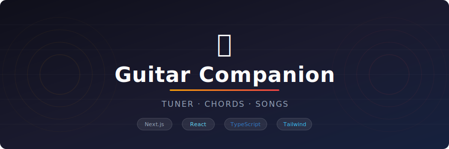

<div align="center">



</div>

<br/>

A comprehensive guitar practice companion built with Next.js, React, and TypeScript.

## Features

### 🎵 Chromatic Tuner
- Real-time pitch detection using Web Audio API
- Visual feedback with analog-style dial and needle
- Shows note, frequency, and cent deviation
- Noise filtering for accurate readings

### 🎼 Chord Library
- 120+ guitar chords across all 12 notes (Major, Minor, 7th, Maj7, m7, Dim, Aug, Sus2, Sus4, Add9)
- Interactive chord diagrams with finger positions
- Filter by chord type
- Search functionality
- Audio playback for each chord

### 📚 My Songs
- Add and manage your song collection
- Store lyrics with inline chord markers — hover any chord to see its diagram
- Add personal notes per song
- Import songs directly from tabsy.gr (auto-extracts title, artist and chords)
- Export / import your entire library as JSON
- Cloud storage via Supabase

### 🎧 Playlists
- Create named playlists for gigs, practice sessions, or any occasion
- Add and remove songs from your library
- Manage multiple setlists side by side

### 🎸 Transpose Tool
- Per-song +/− semitone buttons shift all chords instantly
- Transposed chords appear in both the chord list and inline in lyrics
- One-click save to persist the new key to your library

### ♩ Metronome
- BPM slider (40–240), tap tempo, and 4-beat visual indicator
- Web Audio API lookahead scheduler for drift-free timing
- BPM saved per song — opens pre-loaded when navigating from a song
- Tempo name display (Largo → Presto)

### 📜 Auto-scroll Lyrics
- Floating play/pause bar at the bottom of any song with lyrics
- Adjustable scroll speed — completely hands-free while playing

### 🔁 Chord Progression Builder
- Build progressions like Am – F – C – G
- Loop playback with metronome timing, selectable beats per chord
- Save and manage multiple progressions
- Live chord diagram shown for the currently playing chord

## Getting Started

### Installation
```bash
# Navigate to the project
cd guitar-app

# Install dependencies (if not already installed)
npm install

# Run development server
npm run dev
```

Open [http://localhost:3000](http://localhost:3000) in your browser.

### Build for Production
```bash
npm run build
npm start
```

## Project Structure
```
guitar-app/
├── app/
│   ├── page.tsx              # Home — navigation cards
│   ├── layout.tsx            # Root layout
│   ├── globals.css           # Global styles & design tokens
│   ├── tuner/                # Chromatic tuner page
│   ├── chords/               # Chord library page
│   ├── songs/
│   │   ├── page.tsx          # Songs list
│   │   └── [id]/page.tsx     # Song detail (transpose, auto-scroll, BPM)
│   ├── playlists/            # Playlists page
│   ├── metronome/            # Metronome page
│   └── progressions/         # Chord progression builder page
├── components/
│   ├── Tuner.tsx             # Chromatic tuner component
│   ├── ChordsLibrary.tsx     # Chord library component
│   ├── SongsLibrary.tsx      # Songs management component
│   ├── ChordDiagram.tsx      # SVG chord diagram renderer
│   ├── ChordTooltip.tsx      # Hover tooltip with chord diagram
│   ├── GeneralImport.tsx     # Import from tabsy.gr
│   ├── PlaylistsLibrary.tsx  # Playlists component
│   ├── Metronome.tsx         # Web Audio lookahead metronome
│   └── ProgressionBuilder.tsx # Chord progression builder
├── data/
│   └── chords.ts             # Chord database (120+ chords)
├── lib/
│   ├── storage.ts            # Supabase CRUD helpers
│   ├── supabase.ts           # Supabase client
│   └── transpose.ts          # Chord transposition utilities
└── types/
    └── index.ts              # TypeScript interfaces
```

## Technologies Used
- **Next.js 15** - React framework
- **TypeScript** - Type safety
- **Supabase** - PostgreSQL cloud database
- **Web Audio API** - Tuner, metronome scheduling, and chord playback
- **Space Grotesk** - UI font

## Usage

### Tuner
1. Click "Start Tuner"
2. Allow microphone access
3. Play a string on your guitar
4. Tune based on the dial and cent readout

### Chords
1. Browse or search for chords
2. Click "Play Sound" to hear the chord
3. Use filters to find specific chord types

### My Songs
1. Click "+ Add New Song" or import from tabsy.gr
2. Enter song details, chords, and lyrics
3. Save to your personal library
4. Click any song to view details, transpose, or auto-scroll

### Metronome
1. Set BPM with the slider or tap the Tap button
2. Click Start — beat dots pulse on every beat
3. BPM is saved per song automatically

### Chord Progressions
1. Click "+ New Progression" and give it a name
2. Pick chords from the root + suffix picker
3. Set BPM and beats per chord, then hit Play to loop

## License
MIT
